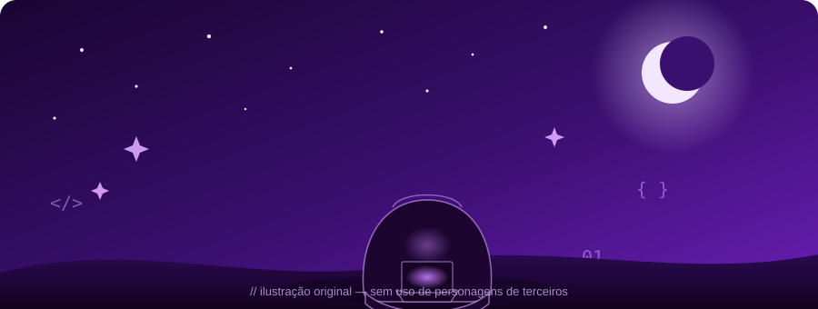

 

<!-- comente/remova a linha abaixo se preferir não expor um contador público de visitas -->

 

**[Sobre mim](#sobre-mim)** ·
**[Stack](#stack)** ·
**[Estatísticas](#estatisticas)** ·
**[Atividade](#atividade)** ·
**[Anime corner](#anime)** ·
**[Projetos](#projetos)** ·
**[Contato](#contato)**

  

## 🔮 Sobre mim

<table>
<tr>
<td width="55%" valign="middle">

- 🇧🇷 Brasil
- Estudante do **3º ano do Ensino Médio Integrado ao Técnico em Desenvolvimento de Sistemas**
- Focado em **Desenvolvimento Web**
- Sempre aprendendo novas tecnologias
- Em busca de **estágio** ou **vaga de jovem aprendiz**
- Gosto de criar interfaces bonitas e bem pensadas
- Se não sei, eu pesquiso até saber

</td>
<td width="45%">

</td>
</tr>
</table>

  

## 🛠️ Tech Stack

<table align="center">
<tr>
<th>Frontend</th>
<th>Backend</th>
<th>Banco de Dados</th>
<th>Ferramentas</th>
</tr>
<tr>
<td valign="top">
   
   
   

</td>
<td valign="top">
   
   
 
</td>
<td valign="top">
  
</td>
<td valign="top">
   
   
</td>
</tr>
</table>

  

## 📊 Estatísticas

  
  

  

  

## 🐍 Snake eating contributions

  <picture>
    <source media="(prefers-color-scheme: dark)" srcset="https://raw.githubusercontent.com/MatheusFli/MatheusFli/output/github-contribution-grid-snake-dark.svg" />
    <source media="(prefers-color-scheme: light)" srcset="https://raw.githubusercontent.com/MatheusFli/MatheusFli/output/github-contribution-grid-snake.svg" />
    
  </picture>

 

  

## 📈 Gráfico de Contribuições

  

  

  

  

## 🌙 Anime corner

<table>
<tr>
<td width="45%">

</td>
<td width="55%" valign="middle">

Toda madrugada de código merece uma trilha sonora certa e uma boa dose de inspiração.

</td>
</tr>
</table>

  

## 🚀 Projetos em Destaque

  
  

| Projeto | Status | Stack |
|:--|:--:|:--|
| 🛒 **TCC — Loja Virtual** | em desenvolvimento | HTML · CSS · JS · Node.js |
| 🌐 **Portifólio** | em desenvolvimento | HTML · CSS · JS |
| ✨ **Lista de tarefas** | planejamento | — |

<!--
  IMPORTANTE — os cartões acima ("Repo Card") só carregam se:
  1. MatheusFli foi trocado pelo seu usuário real (já feito);
  2. tcc-loja-node / Portifolio forem nomes de repositórios que
     JÁ EXISTEM e são PÚBLICOS na sua conta (o card busca dados reais
     via API — se o repo não existir ou estiver privado, a imagem
     vem quebrada). Se o nome exato do repositório for diferente
     (maiúsculas/minúsculas importam!), corrija o parâmetro repo=.
  3. Depois, fixe esses mesmos repositórios no seu perfil em
     github.com/MatheusFli → "Customize your pins".
-->

  

## 📬 Contato

  
  
  
  

*"First, solve the problem. Then, write the code." — John Johnson*

<a href="#topo">⬆ Voltar ao topo</a>

